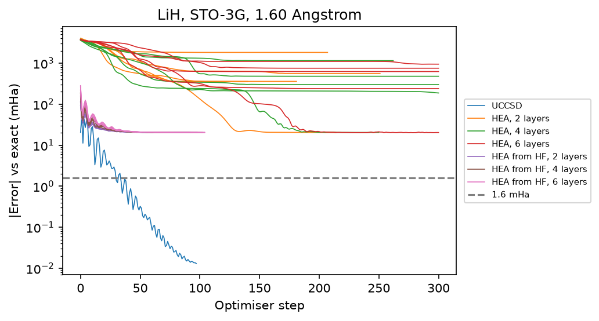

# qml-chemistry-projects

Variational quantum algorithms on molecular Hamiltonians, simulated with PennyLane.

Each experiment is set up the same way: a fixed optimisation budget shared by every method, reference values computed independently of the training, several seeds wherever the initialisation is random, and conclusions limited to what the stored results show.

## Projects

| Project | Question | Result so far |
|---|---|---|
| [VQE_Molecules](VQE_Molecules/) | Under one optimisation budget, which is easier to train to chemical accuracy: an ansatz built for the problem (UCCSD) or a generic layered one (hardware-efficient, HEA)? | On LiH (12 qubits, 5 bond lengths), UCCSD reached chemical accuracy at 5 of 5 geometries. The HEA reached it in 0 of 75 runs from random angles, and in 0 of 75 runs when started next to the Hartree–Fock state, where every run settled on the Hartree–Fock energy. |



Error against the exact energy during training, LiH at 1.60 Å. One line per run; the dashed line is chemical accuracy (1.6 mHa). Details and limitations are in the [project README](VQE_Molecules/README.md).

Next in this project: the same comparison on BeH2 (14 qubits), ADAPT-VQE, and CPU against GPU simulation time on hydrogen chains.

## Repository layout

```
qml-chemistry-projects/
├── README.md
├── requirements.txt
└── VQE_Molecules/
    ├── README.md     questions, method, results, limitations
    ├── code/         one script per step, plus shared helpers
    ├── results/      CSV files and console output written by the scripts
    └── figures/      figures written by the scripts
```

## Setup

```
python -m venv .venv
.venv\Scripts\activate        # Linux/macOS: source .venv/bin/activate
pip install -r requirements.txt
```

Molecular Hamiltonians come from `qml.qchem`, which does not need PySCF. The commands for each experiment are in the project README.

## Environment of the stored results

| Results | Machine | Versions |
|---|---|---|
| H2 | Windows | PennyLane 0.45.1, pennylane-lightning 0.45.0, NumPy 2.5.3, SciPy 1.18.1 |
| LiH | Linux cluster, CPU | PennyLane 0.45.1 |
