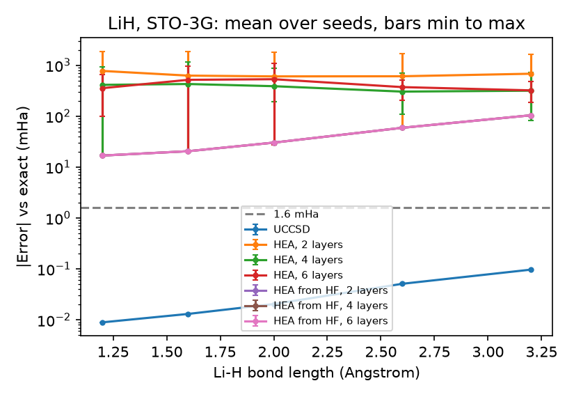

# VQE_Molecules

A comparison of two variational quantum eigensolver (VQE) ansätze on the ground-state energy of H2 and LiH, on a noiseless statevector simulator.

## Summary

- **Question.** Under one optimisation budget, which is easier to train to chemical accuracy (1.6 mHa): UCCSD, which is built for the problem, or a generic hardware-efficient ansatz (HEA)?
- **H2 (4 qubits)** checks the pipeline. UCCSD is within 0.01 mHa of the exact energy at all 22 bond lengths.
- **LiH (12 qubits)** is the comparison. UCCSD (92 parameters) reached chemical accuracy at 5 of 5 bond lengths, with errors from 0.009 to 0.097 mHa. The HEA with random initial angles reached it in 0 of 75 runs; its best runs ended at the Hartree–Fock energy, which is where UCCSD starts.
- **Control for the starting point.** Starting the HEA next to the Hartree–Fock state removed the spread between seeds, but all 75 control runs settled on the Hartree–Fock energy and none went below it. The starting point explains the large errors of the randomly initialised HEA; it does not explain its failure to reach chemical accuracy.

## Roadmap

| Step | Content | Status |
|---|---|---|
| 1 | H2 Hamiltonian and reference energies | Done |
| 2 | UCCSD-VQE on H2, dissociation curve | Done |
| 3 | LiH: UCCSD against HEA, with a control for the starting point | Done |
| 4 | BeH2 (14 qubits): UCCSD against HEA | Planned |
| 5 | ADAPT-VQE: error against number of parameters, compared with UCCSD | Planned |
| 6 | CPU against GPU statevector simulation time on hydrogen chains | Planned |

## Files

| Script in `code/` | What it does | Output |
|---|---|---|
| `vqe_common.py` | Shared helpers: geometry, Hamiltonian, reference energies, optimisation loop | |
| `step01_h2_hamiltonian.py` | H2 Hamiltonian at 0.74 Å and its reference energies | `results/step01_output.txt` |
| `step02_h2_vqe.py` | UCCSD-VQE on H2: one geometry, then 22 bond lengths | `results/h2_dissociation.csv`, `results/step02_output.txt`, `figures/h2_*.png` |
| `step02b_h2_checks.py` | Matrix elements of the H2 Hamiltonian and a single-gate ansatz | `results/step02b_output.txt` |
| `step03_uccsd_vs_hea.py` | UCCSD against HEA on LiH or BeH2 (`--molecule`): 5 bond lengths, 3 depths, 5 seeds, 2 ways of starting the HEA | `results/lih_ansatz.csv`, `results/lih_histories.jsonl`, `figures/lih_*.png`; the same with `beh2_` for BeH2 |

`lih_ansatz.csv` has one row per training run. `lih_histories.jsonl` has the energy at every optimiser step of every run. The `.txt` files are console output.

## Method

- **Hamiltonian.** `qml.qchem`, STO-3G basis, Jordan–Wigner mapping. The chemistry is used as a black box that turns a geometry into a qubit Hamiltonian.
- **Loss.** The energy ⟨H⟩ of the circuit's output state. No reference value enters the training.
- **Reference values.** The Hartree–Fock (HF) energy is the diagonal element of the Hamiltonian at the HF basis state. The exact energy is the lowest eigenvalue of the Hamiltonian restricted to basis states with the correct number of electrons, which equals the FCI energy in the same basis. Errors are reported against the exact energy.
- **Budget, shared by all runs.** `lightning.qubit` with adjoint differentiation; Adam with step size 0.05; at most 300 steps; stop after 5 consecutive steps that each change the energy by less than 1e-6 Ha.
- **UCCSD.** Starts from the HF state with all parameters at zero. Deterministic, so one run per geometry.
- **HEA.** Each layer applies RY and RZ to every qubit, then a ring of CNOTs. Starts from |0…0⟩ with angles drawn uniformly from [−π, π). Depths of 2, 4 and 6 layers, 5 seeds each.
- **HEA from HF (control).** The same circuit, started from the basis state that its CNOT rings map onto the HF state, so that with every angle at zero the output is exactly the HF state. Angles are drawn uniformly from [−0.1, 0.1); this range was not tuned.

## Results for H2

At 0.74 Å ([results/step01_output.txt](results/step01_output.txt)):

| Quantity | Value |
|---|---|
| Qubits | 4 |
| Pauli terms | 15 |
| Hartree–Fock energy | −1.116759 Ha |
| Exact energy | −1.137284 Ha |
| Correlation energy | −20.525 mHa |

UCCSD has 3 parameters here (2 singles, 1 double). At 0.74 Å it reached −1.137284 Ha in 86 steps, an error of 0.0003 mHa.


Along the dissociation curve, 22 bond lengths from 0.4 to 2.5 Å ([results/h2_dissociation.csv](results/h2_dissociation.csv)): all 22 are within chemical accuracy. The largest error is 0.0099 mHa at 2.1 Å, and the optimiser took between 81 and 106 steps.


A single `DoubleExcitation` gate on the HF state already gives the exact energy at 0.74 Å (θ = 0.2256, [results/step02b_output.txt](results/step02b_output.txt)), because the ground state is a superposition of |1100⟩ and |0011⟩ only. The errors above therefore come from the optimiser, not from the ansatz. The stopping rule shows this directly: when the optimiser stopped at the first step below the tolerance, the largest error was 0.77 mHa at 1.1 Å after 34 steps and 5 of the 22 points were above 0.1 mHa. The stored results require 5 consecutive steps.

## Results for LiH

LiH has 12 qubits, 4 electrons and 631 Pauli terms. All numbers below are from [results/lih_ansatz.csv](results/lih_ansatz.csv) and [results/lih_histories.jsonl](results/lih_histories.jsonl): 155 training runs, each done once.

Errors against the exact energy, in mHa:

| Bond length (Å) | HF state, before training | UCCSD, 92 parameters | HEA, random start: best of 15 | HEA from HF: range over 15 |
|---|---|---|---|---|
| 1.20 | 16.815 | 0.009 | 16.818 | 16.816 to 16.822 |
| 1.60 | 20.460 | 0.013 | 20.388 | 20.461 to 20.466 |
| 2.00 | 30.182 | 0.020 | 27.186 | 30.183 to 30.189 |
| 2.60 | 58.996 | 0.051 | 58.996 | 58.997 to 59.002 |
| 3.20 | 103.858 | 0.097 | 83.112 | 103.859 to 103.863 |

Runs within chemical accuracy: UCCSD 5 of 5, HEA with random start 0 of 75, HEA from HF 0 of 75.



Points are the mean over seeds; bars run from the smallest to the largest error. The three "HEA from HF" lines lie on top of each other.

**UCCSD** stopped after 95 to 106 steps at every bond length, so the 300-step budget did not limit it. Its error grows with the bond length. Its first Adam step raises the error at all 5 bond lengths (from 20.5 to 49.8 mHa at 1.60 Å); the energy then oscillates downwards and first passes 1.6 mHa after 30 to 35 steps.

**HEA with random start** by depth, over the 25 runs at each depth (5 bond lengths × 5 seeds):

| Layers | Parameters | Mean error (mHa) | Median error (mHa) | Runs that used all 300 steps |
|---|---|---|---|---|
| 2 | 48 | 657 | 467 | 4 of 25 |
| 4 | 96 | 369 | 300 | 16 of 25 |
| 6 | 144 | 418 | 397 | 24 of 25 |

- Ten of the 75 runs ended at the HF energy or below it (no more than 0.2 mHa above). The other 65 ended above the HF energy, which UCCSD has before any training.
- The lowest HEA error relative to the HF energy was at 3.20 Å: 83.1 mHa against 103.9 mHa.
- The spread over seeds is as large as the mean. At 1.60 Å with 2 layers, the errors of the 5 seeds run from 20.5 to 1825 mHa. With this spread, 4 and 6 layers cannot be ranked.
- 31 runs met the stopping rule before 300 steps, all of them with an error of at least 16.8 mHa. Meeting the stopping rule says the energy has stopped changing, not that it is close to the exact energy.
- The HEA does not conserve the number of electrons, so it could in principle go below the exact energy of the 4-electron sector. It did not: at all 5 bond lengths the lowest eigenvalue over all sectors equals the exact energy, and no run has a negative error.

**HEA from HF (control).**

- Before training, the 75 control runs are 90 to 338 mHa above the exact energy: near the HF state, and further from it with more layers, because every angle is perturbed (90 to 191 mHa with 2 layers, 216 to 338 mHa with 6).
- All 75 runs then came back to the HF energy, ending between 0.001 and 0.007 mHa above it, and met the stopping rule after 87 to 109 steps. None ended below the HF energy.
- The spread over seeds fell from hundreds of mHa to about 0.002 mHa. The large errors and the seed dependence of the randomly initialised HEA therefore come from its starting point.
- A fair start did not make the HEA reach chemical accuracy. From the same state, UCCSD recovered more than 99.9% of the gap between the HF and exact energies and the HEA recovered none of it.
- The circuit can represent states below the HF energy: with a random start, one 4-layer run at 3.20 Å ended at 83.1 mHa, 20.7 mHa below HF, while the five 4-layer runs started from HF ended at 103.86 mHa. At least in that case the limit is the optimisation, not what the circuit can express.


## Reproduce

From `VQE_Molecules/code/`, with the environment from the top-level README:

```
python step01_h2_hamiltonian.py
python step02_h2_vqe.py
python step02b_h2_checks.py
python step03_uccsd_vs_hea.py --molecule LiH --quick       # 3 steps per run: checks the script and gives timings
python step03_uccsd_vs_hea.py --molecule LiH               # 155 runs; 48 minutes of training on a cluster CPU node
python step03_uccsd_vs_hea.py --molecule LiH --plot-only   # redraw the figures from the CSV
```

`step03_uccsd_vs_hea.py` appends one row to the CSV after every run and skips runs that are already there, so an interrupted job can be restarted with the same command. It also appends its console output to `results/step03_lih_output.txt`. The stored LiH results were produced by an earlier version of the script, `step03_lih_vqe.py`, in two invocations (80 runs, then the 75 control runs) and before the console log was added, so that file is not in the repository. Both LiH figures were redrawn from the CSV with `--plot-only` after the runs. `--molecule BeH2` has not been run yet.

## Limitations

- Noiseless statevector simulation: no shot noise, no device noise.
- STO-3G is a minimal basis. "Exact" means exact within this basis, not the energy of the real molecule.
- Each number comes from a single run.
- The control shows that the HEA started from HF stays at the HF energy under this budget. It does not show why: whether the HF state is a local minimum or a saddle point of this circuit, and whether more steps or a looser stopping rule would leave it, was not tested. The angle range of the control (0.1) was not varied.
- 24 of the 25 six-layer HEA runs used the whole 300-step budget, so for that depth "hard to train" and "budget too small" are not separated.
- The 5 HEA seeds give the same initial angles at every bond length, so results at different bond lengths are not independent samples.
- The HEA conclusions hold for this layer structure, this initialisation and this budget only.
- The VQE energies and step counts are not identical across machines. A rerun of the H2 curve on a Linux cluster gave the same HF and exact energies but a largest error of 0.052 mHa at 2.3 Å, with 81 to 110 steps.
- The number of two-qubit gates is not recorded. The HEA has 12 CNOTs per layer; the UCCSD circuit was not counted.
