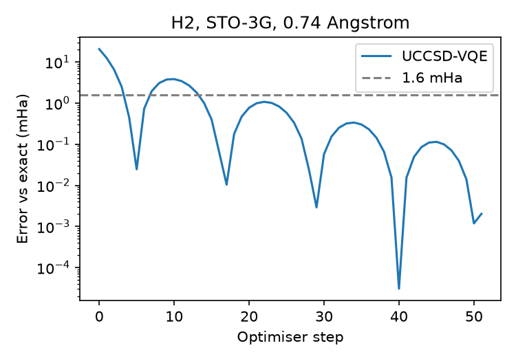
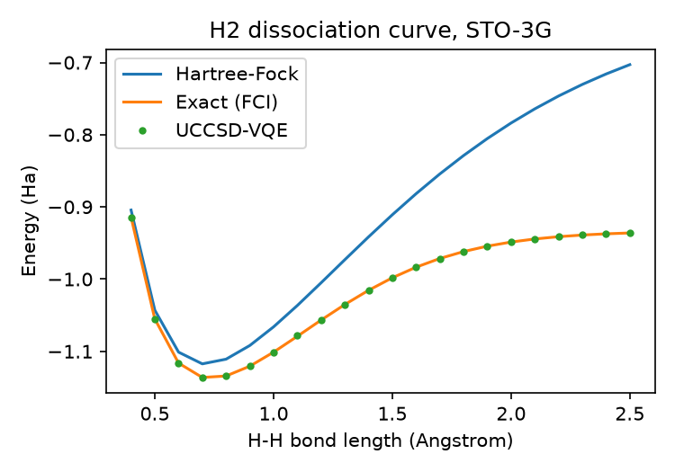

# VQE_Molecules

A benchmark of variational quantum eigensolver (VQE) ansätze on the ground-state energy of small molecules, on a noiseless statevector simulator.

## Questions

1. Under the same optimisation budget, how far from the exact energy do UCCSD, a hardware-efficient ansatz (HEA) and ADAPT-VQE end up, and with how many parameters and two-qubit gates?
2. How do those errors change as a bond is stretched, and how sensitive is the HEA to its random initialisation?
3. How does statevector simulation time grow with the number of qubits, and from what size is a GPU faster than a CPU?

## Status

| Step | Content | Status |
|---|---|---|
| 1 | H2 Hamiltonian and reference energies | Done |
| 2 | UCCSD-VQE on H2, dissociation curve | Done |
| 3 | LiH and BeH2: UCCSD against HEA (5 seeds) | Planned |
| 4 | ADAPT-VQE | Planned |
| 5 | CPU against GPU timing on hydrogen chains | Planned |

Only H2 has results so far. Questions 1 to 3 are not answered yet: H2 is too small to separate the ansätze.

## Method

- Hamiltonian: `qml.qchem`, STO-3G basis, Jordan–Wigner mapping.
- Reference energies: the Hartree–Fock energy is the diagonal element of the Hamiltonian at the HF basis state. The exact energy is the lowest eigenvalue of the Hamiltonian restricted to basis states with the correct number of electrons, which equals the FCI energy in the same basis.
- VQE: UCCSD starting from the HF state (all parameters zero), `lightning.qubit` with adjoint differentiation, Adam with step size 0.05, at most 300 steps, stopping when the energy changes by less than 1e-6 Ha.
- Errors are reported against the exact energy, with chemical accuracy taken as 1.6 mHa.

## Results for H2

At 0.74 Å ([results/step01_output.txt](results/step01_output.txt)):

| Quantity | Value |
|---|---|
| Qubits | 4 |
| Pauli terms | 15 |
| Hartree–Fock energy | −1.116759 Ha |
| Exact energy | −1.137284 Ha |
| Correlation energy | −20.525 mHa |

UCCSD has 3 parameters here (2 singles, 1 double). At 0.74 Å it reached −1.137282 Ha in 51 steps, an error of 0.002 mHa.



Along the dissociation curve, 22 bond lengths from 0.4 to 2.5 Å ([results/h2_dissociation.csv](results/h2_dissociation.csv)): all 22 are within chemical accuracy. The largest error is 0.77 mHa at 1.1 Å, where the optimiser stopped after 34 steps; 17 of the 22 points are below 0.1 mHa.



A single `DoubleExcitation` gate on the HF state already gives the exact energy at 0.74 Å (θ = 0.2256, [results/step02b_output.txt](results/step02b_output.txt)), because the ground state is a superposition of |1100⟩ and |0011⟩ only. The errors above therefore come from the optimiser, not from the ansatz. The stored results use `PATIENCE = 1` in `step02_h2_vqe.py`, which stops at the first step below the tolerance.

## Reproduce

From the repository root, with the environment from the top-level README:

```
python VQE_Molecules/code/step01_h2_hamiltonian.py
python VQE_Molecules/code/step02_h2_vqe.py
python VQE_Molecules/code/step02b_note_checks.py
```

`step02_h2_vqe.py` rewrites `results/h2_dissociation.csv` and both figures. The `.txt` files in `results/` are the console output of the three scripts.

## Limitations

- Noiseless statevector simulation: no shot noise, no device noise.
- STO-3G is a minimal basis. "Exact" means exact within this basis, not the energy of the real molecule.
- Each number comes from a single run.
- H2 in this basis is solved exactly by UCCSD, so these results check the pipeline and say nothing yet about how the ansätze compare.
